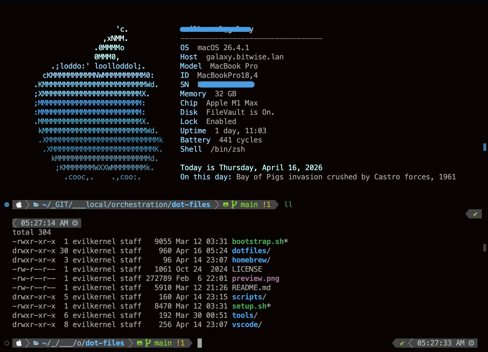

<h1 align="center">
  
  
  
  <br>
  <br>
  <code><strong>.dot-files</strong></code>
</h1>

<p align="center">
  
  
  
</p>

<p align="center">
  Personal configuration files and setup scripts for macOS.<br>
  Automates installation and configuration of development tools, shell environments, and editor settings.
</p>

---

## Quick Start

```bash
git clone https://github.com/BitWise-0x/.dot-files && cd .dot-files && ./bootstrap.sh
```

## Repository Structure

```
├── vscode/              VSCode settings, keybindings, MCP, snippets, extensions
├── homebrew/            Brewfile (all Homebrew packages)
├── tools/               System tool configs
│   ├── docker/            Docker daemon config
│   ├── colima/            Colima VM settings
│   ├── gh/                GitHub CLI config
│   └── git/               Global gitignore rules
├── dotfiles/            Shell & editor configs (synced to ~/)
│   ├── .zshrc, .bashrc, .aliases, .functions, ...
│   ├── .custom/           Custom shell scripts
│   ├── .oh-my-zsh/        Powerlevel10k theme
│   ├── .vim/colors/       Vim color schemes
│   ├── .ssh/config        SSH configuration
│   ├── .warp/             Warp terminal config
│   └── ...
├── .fonts/              Nerd Fonts (MesloLGS, FiraCode, Hack, etc.)
├── scripts/             Backup & restore utilities
│   ├── backup-dev-env.sh  Full dev environment backup
│   └── restore-dev-env.sh Restore from backup archive
├── bootstrap.sh         Sync repo configs → system (repo → ~/)
└── setup.sh             Fresh install (Homebrew, Oh-My-Zsh, fonts, tools)
```

---

## Scripts

### `setup.sh`

Installs essential tools and applications using Homebrew. Run this first on a fresh system.

```bash
./setup.sh
```

### `bootstrap.sh`

Syncs dotfiles and configs from the repo to your system.

```bash
./bootstrap.sh              # Interactive mode (prompts for confirmation)
./bootstrap.sh --force      # Skip confirmation prompt
./bootstrap.sh --no-brew    # Skip Homebrew install/sync (faster re-runs)
./bootstrap.sh -f --no-brew # Combine flags
```

### `scripts/backup-dev-env.sh`

Backs up your full dev environment (VSCode, Homebrew, dotfiles, tool configs) to a timestamped archive.

```bash
./scripts/backup-dev-env.sh              # Create backup archive
./scripts/backup-dev-env.sh --sync-repo  # Also sync changes back to repo
./scripts/backup-dev-env.sh --no-archive # Keep as directory (no .tar.gz)
```

### `scripts/restore-dev-env.sh`

Restores from a backup archive or directory.

```bash
./scripts/restore-dev-env.sh <backup.tar.gz>        # Restore from archive
./scripts/restore-dev-env.sh <backup-dir> --dry-run  # Preview without changes
./scripts/restore-dev-env.sh <backup> --no-brew      # Skip Homebrew restore
```

---

## Compatibility

| | Apple Silicon (ARM) | Intel (x86) |
|---|---|---|
| **Dotfiles & configs** (`--no-brew`) | Full support | Full support |
| **Homebrew packages** (`setup.sh` / Brewfile) | Full support (bottles) | macOS 14+ recommended; macOS 13 compiles from source (slow) |
| **ARM-only packages** (e.g. `asitop`) | Installed | Automatically skipped |

> **Secondary machines**: If you only need configs in sync, use `./bootstrap.sh --no-brew` to skip Homebrew entirely.

---

## Features

<table>
<tr>
<td valign="top">

### Shell


- Oh-My-Zsh with plugins (autosuggestions, autocomplete, syntax-highlighting)
- Powerlevel10k theme
- Custom prompt, completions, and configurations

</td>
</tr>
<tr>
<td valign="top">

### Editors & Terminals


- VSCode: settings, keybindings, MCP servers, snippets, extensions
- iTerm2: color schemes (auto-imported), font configuration
- Vim: custom `.vimrc` and color schemes
- Warp & Windows Terminal configs

</td>
</tr>
<tr>
<td valign="top">

### Development Tools


- **Languages**: Python 3.12, Node.js, PHP, Ruby
- **Version Mgmt**: nvm, virtualenv, virtualenvwrapper
- **Containers**: Docker, Docker Compose, Colima
- **Git**: git, git-lfs, GnuPG for commit signing
- **CLI**: GNU coreutils, findutils, sed, grep, wget, rsync, fzf, tree

</td>
</tr>
<tr>
<td valign="top">

### Security / CTF


- **Network**: nmap, aircrack-ng, tcpflow, tcpreplay, tcptrace, socat, dns2tcp
- **Cracking**: hashcat, john, sqlmap
- **Analysis**: xpdf, pngcheck, knock, cifer

</td>
</tr>
<tr>
<td valign="top">

### Fonts

MesloLGS NF (Regular, Bold, Italic, Bold Italic) — optimized for Powerlevel10k

</td>
</tr>
</table>

---

## Preview



<br>

## License

MIT License — see [LICENSE](LICENSE) for details.
